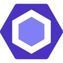

# 👋 Ahmed Nule | Software Engineer 
## About Me
I'm a passionate **Software Engineer** specializing in creating innovative web applications and AI-powered solutions. Currently **Working on shambasync**, contact me for new opportunities.

## 🚀 Previous Current Work
- **Frontend Developer** at Goymarey Enterprise

## 💻 Tech Stack

### Languages & Frameworks

### Tools & Technologies

### Development & Deployment
- **Hosting:** Vercel, Render, Netlify, Digital Ocean
- **Mobile:** React Native
- **Desktops:** Electron
- **Data & APIs:** Prisma,@Prisma/Client, MySQL, Sequelize, PostgreSQL, Chart.js, Graghql, Apollo Server, Apollo-server-express

### UI/UX Designs
- Figma
- Excalidraw.
- Material UI
- Acetenity UI
- Gemini Brainstorming Model

## 🌱 Learning & Growth
Currently exploring and enhancing skills in:
- Web3

## 📊 GitHub Performance

## 🤝 Let's Connect

## 💡 Fun Fact
I'm passionate about mentoring aspiring developers and creating innovative tech solutions. Always open to collaboration and learning!

---

